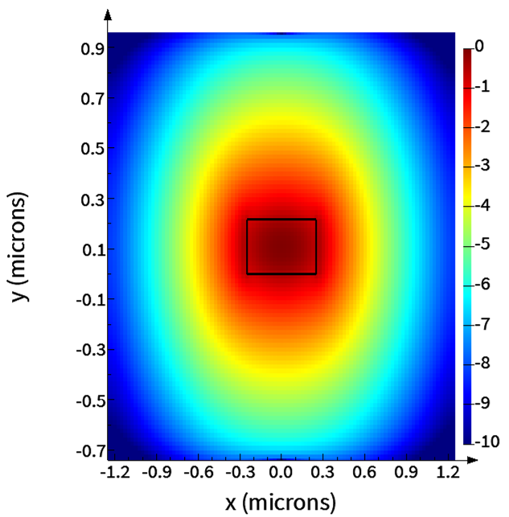
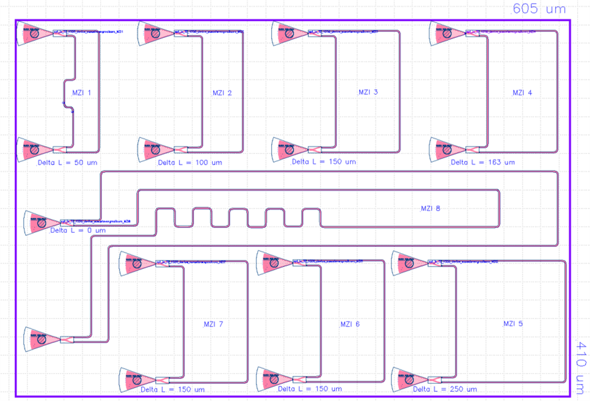
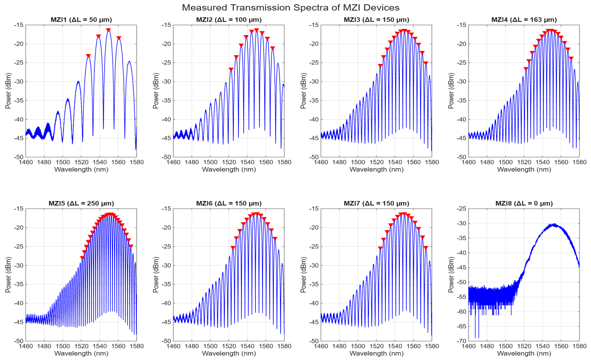
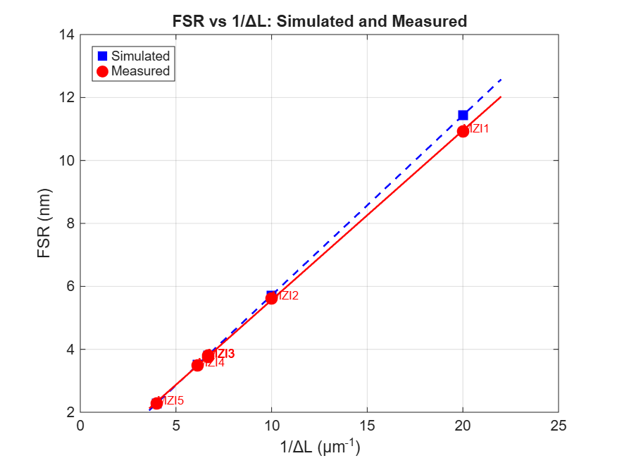
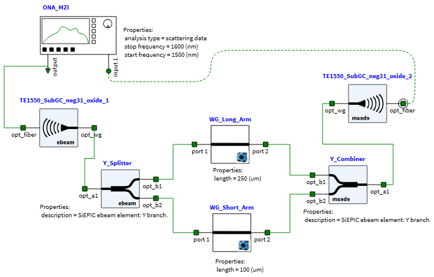
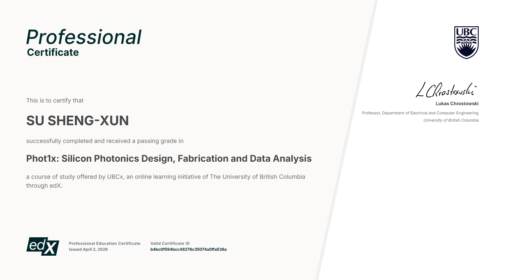

# Silicon Photonics MZI Design, Fabrication & Characterization

This repository presents an end-to-end **silicon photonics design and characterization workflow** for Mach–Zehnder Interferometers (MZIs), covering the complete development cycle from waveguide simulation, circuit modeling, layout implementation, fabrication, measurement, and data analysis.

Originally developed through the **University of British Columbia (UBC) Phot1x Silicon Photonics course**, this project was further extended into an independent design study focusing on **MZI design, compact modeling, process variation analysis, and measurement-based device validation**.

📄 **IEEE-format technical report:**  
[`MZI_Technical_Report.pdf`](./report/Silicon_Photonics_MZI_Report.pdf)

---

# 🧠 Design Flow Overview

## 1. Waveguide Simulation & Compact Modeling

- Modeled SOI strip waveguides using Lumerical MODE FDE solver.
- Extracted key optical parameters:
  - Effective index ($n_{eff}$)
  - Group index ($n_g$)
  - Optical mode profile
- Developed second-order Taylor expansion compact models for circuit-level simulation in Lumerical INTERCONNECT.

**Objective:**  
Establish accurate waveguide models to predict MZI spectral behavior and enable reliable circuit-level simulation.

---

## 2. Circuit Simulation & Process Variation Analysis

- MZI circuits simulated using **Lumerical INTERCONNECT**.
- Analyzed Free Spectral Range (FSR) dependence on optical path difference ($\Delta L$).
- Performed corner analysis considering fabrication variations:

  - Waveguide width variation: ±10 nm
  - Waveguide thickness variation: ±10 nm

**Objective:**  
Evaluate the impact of fabrication uncertainty on device performance and design robustness.

---

## 3. Layout Design & Fabrication

- Designed eight MZI variants with different optical path differences:
  - ΔL = 0–250 μm
- Layout was manually designed using:
  - KLayout
  - SiEPIC EBeam PDK
- The designed devices were fabricated through the UBC Electron Beam Lithography Shuttle process for experimental characterization.

**Objective:**  
Bridge the gap between simulated photonic devices and fabricated hardware through a complete design-to-measurement workflow.

---

## 4. Experimental Data Analysis

By bridging the gap between simulation and measured device data, this project demonstrates simulation-to-measurement validation of silicon photonic devices.

Key performance metrics include:

- <2.7% deviation between simulated and measured group index.
- <0.7% FSR variation between nominally identical fabricated devices, demonstrating strong device repeatability.

Two independent approaches were developed for waveguide group index extraction:

- Simulation-based extraction using Lumerical MODE.
- Measurement-based extraction using MZI spectral characteristics.

The consistency between both approaches validates the reliability of the simulation model and measurement analysis workflow.

---

# 🔬 Key Achievements & Results

By bridging the gap between simulation and fabrication, this project demonstrates complete **simulation-to-measurement validation** of silicon photonic devices.

Key performance metrics include:

- **<2.7% deviation** between simulated and measured waveguide group index.

- **<0.7% FSR variation** between identical fabricated devices, demonstrating strong device repeatability.

- Developed two independent approaches for waveguide group index extraction:

  1. Simulation-based extraction using Lumerical MODE.
  2. Measurement-based extraction using MZI spectral characteristics.

The consistency between both approaches validates the reliability of the simulation model and measurement analysis workflow.

---

# 📊 Technical Results

## 1. Waveguide Simulation (Lumerical MODE)

The SOI strip waveguide was simulated using the Lumerical MODE FDE solver. The fundamental TE mode at 1550 nm was analyzed to extract key waveguide properties, including the effective index ($n_{eff}$), group index ($n_g$), and optical mode profile.

## 2. PIC Layout Design (KLayout + SiEPIC EBeam PDK)

The MZI layout was designed using KLayout with the SiEPIC EBeam PDK. Eight MZI devices were implemented by adjusting the optical path difference ($\Delta L$) to enable FSR analysis, group index extraction, and device repeatability evaluation.

## 3. MZI Measurement Data Analysis

Transmission spectra from eight fabricated MZI devices were analyzed using MATLAB/Python-based workflows. Peak detection was applied to extract the free spectral range (FSR) from measured optical responses.

## 4. FSR-Based Group Index Extraction

The relationship between FSR and inverse path length difference ($1/\Delta L$) was analyzed to extract the group index. The measurement-based extraction was compared with the Lumerical MODE simulation result for model verification.

## 5. Circuit Simulation and Measurement Comparison

The MZI circuit was simulated in Lumerical INTERCONNECT using the extracted waveguide compact model. The simulated transmission behavior was compared with measured device characteristics to validate the design workflow.

---

# 🛠 Tools & Skills Demonstrated

## Photonic Simulation

- Lumerical MODE
- Lumerical INTERCONNECT

## PIC Layout Implementation

- KLayout
- SiEPIC EBeam PDK

## Data Analysis

- Python:
  - NumPy
  - SciPy
  - Matplotlib

## Device Validation & Data Analysis

- UBC EBeam Shuttle fabricated MZI devices
- Optical spectrum analysis and FSR extraction
- Simulation–measurement comparison
- Process variation analysis

## Documentation

- IEEE-format technical report writing
- Technical data visualization

---

# 📁 Repository Contents

| Folder/File | Description |
|------------|-------------|
| [`report/`](./report/) | IEEE-format technical report |
| [`images/`](./images/) | Simulation and measurement results |
| [`README.md`](./README.md) | Project overview |

---

# 👤 About the Author

**Sheng-Xun Su (蘇聖勛)**

M.S. in Optics and Photonics  
National Central University, Taiwan

## Background

- 3.5 years of semiconductor wafer fabrication experience
- Optical material characterization research
- Silicon photonics device design and simulation

## Career Focus

**Silicon Photonics IC Design | Photonic Integrated Circuits (PIC)**

Technical interests:

- Silicon photonic device design
- Photonic integrated circuits
- Optical interconnect technologies

---

# Contact

📧 Email: [sususteven5245@gmail.com]

🔗 LinkedIn: [[Sheng-Xun Su](https://www.linkedin.com/in/sheng-xun-su-55b49634b/)]

---

## 📜 Certification

**Phot1x: Silicon Photonics Design, Fabrication and Data Analysis**  
UBCx (University of British Columbia) through edX

[Verify Certificate](https://courses.edx.org/certificates/b4bc0f594bcc48278c35074a0ffa536a)

